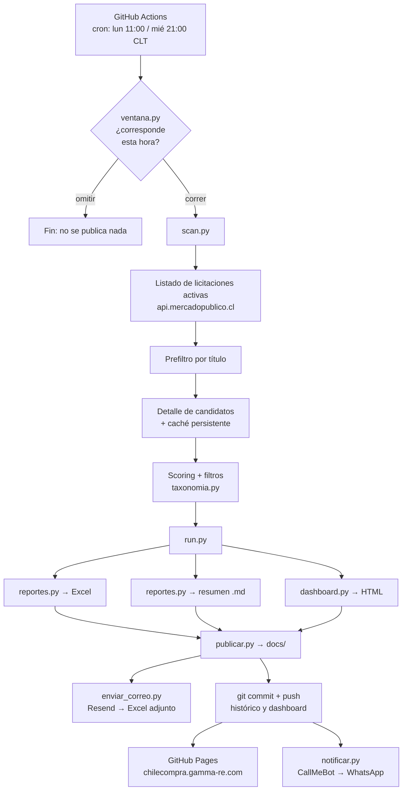

# Radar de Licitaciones — Documentación técnica

Sistema automatizado que detecta, entre las ~4.500 licitaciones activas de Mercado Público,
las que calzan con los servicios inmobiliarios corporativos de **Gamma Real Estate** y
**Realsa Brokers**, y las entrega en tres formatos: dashboard web, Excel con histórico y
resumen ejecutivo.

| | |
|---|---|
| **Repositorio** | `github.com/Strolj-Oderlink/radar-licitaciones` |
| **Dashboard** | https://chilecompra.gamma-re.com |
| **Ejecución** | GitHub Actions — lunes 11:00 y miércoles 21:00, hora de Santiago |
| **Lenguaje** | Python 3.11, sin dependencias más allá de `openpyxl` |
| **Costo** | USD 0 (todos los servicios en plan gratuito) |

---

## 1. Arquitectura



El diseño tiene una propiedad importante: **el pipeline es Python puro y no depende de
ningún modelo de lenguaje en tiempo de ejecución**. El scoring es determinista y auditable,
lo que permite correrlo en cualquier runner barato y explicar por qué cada aviso entró o no.

---

## 2. Componentes

Todo el código vive en `pipeline/`. Cada módulo hace una cosa y se comunica con el
siguiente por archivos en disco, no por memoria compartida — así cada etapa se puede correr
y depurar por separado.

| Archivo | Líneas | Rol |
|---|---|---|
| `ventana.py` | 58 | Guardia horario: decide si esta ejecución corresponde |
| `scan.py` | 240 | Barrido de la API, prefiltro, detalle, scoring, filtros de negocio |
| `taxonomia.py` | 195 | Términos, pesos, exclusiones y clasificación de oportunidad |
| `run.py` | 15 | Orquestador de entregables |
| `reportes.py` | 250 | Excel con histórico y resumen ejecutivo |
| `dashboard.py` | 203 | Dashboard HTML autocontenido |
| `publicar.py` | 30 | Arma `docs/` para GitHub Pages y el texto del aviso |
| `enviar_correo.py` | 96 | Envío del Excel por Resend |
| `notificar.py` | 21 | Aviso por WhatsApp vía CallMeBot |

### 2.1 `ventana.py` — guardia horario

GitHub Actions programa en UTC y Chile alterna entre UTC-4 y UTC-3 según la temporada. Un
cron fijo se correría una hora medio año. La solución: el workflow dispara en **los dos
horarios UTC posibles** y este script deja pasar solo el que cae en la hora local correcta.

```python
VENTANAS = {0: (11, 13), 2: (21, 23)}   # lunes 11:00, miércoles 21:00 (hora Santiago)
RETRASO_MAXIMO_DIAS = 4                 # gatilla corrida de recuperación
```

Crons declarados: `23 14,15,16,17 * * 1` (lunes), `23 0,1,2,3 * * 4` (jueves UTC =
miércoles CLT) y `41 16 * * *` (chequeo diario de recuperación).

**Por qué tantos disparos.** GitHub documenta que los eventos programados se retrasan con
carga alta y que, si la carga es suficiente, **los trabajos encolados se descartan**. El
inicio de cada hora es el peak. La primera versión usaba minuto `:00` con un solo disparo
válido por ventana, y la corrida del miércoles 26-08-2026 simplemente nunca ocurrió. Ahora
hay tres intentos por ventana en cualquiera de los dos husos, en el minuto `:23`. El primero
que entra marca `estado_ejecucion.json` y los demás se omiten en 30 segundos.

**Corrida de recuperación.** El cron diario normalmente omite, pero si pasaron 4 días o más
sin ejecución efectiva, corre igual fuera de ventana y lo advierte en el log. Cubre el caso
de que GitHub descarte todos los intentos de la semana. Como efecto secundario mantiene el
repositorio activo: GitHub deshabilita los workflows programados tras 60 días sin actividad.

Un segundo guardia, `data/estado_ejecucion.json`, evita la corrida doble cuando ambos
disparos caen dentro de la ventana. La variable de entorno `FORZAR=true` salta ambos
controles — es lo que activa la casilla *forzar* al lanzar el workflow a mano.

**Cuando omite, lo dice fuerte**: emite un `::notice::` y escribe en el resumen del job.
Sin eso, una corrida omitida se ve idéntica a una exitosa —job verde, ningún paso rojo— y
es la fuente de confusión número uno del sistema.

### 2.2 `scan.py` — el barrido

Trabaja en dos etapas, y la separación es lo que lo hace viable:

**Etapa 1 — listado.** Una sola llamada a
`licitaciones.json?estado=activas&ticket=...` devuelve ~4.500 avisos, pero solo con código,
nombre, estado y fecha de cierre. No trae descripción, comprador, monto ni categoría.

**Etapa 2 — detalle.** Un `prefiltro()` barato sobre el título decide a cuáles vale la pena
pedirles el detalle completo (`?codigo=XXX`). De 4.500 pasan ~340. Sin este embudo habría
que hacer 4.500 llamadas por corrida en vez de 340.

El detalle se guarda en `data/cache_detalles.json` y **persiste entre corridas**: una
licitación ya descargada no se vuelve a pedir. Por eso la primera corrida tarda minutos y
las siguientes segundos.

#### Piso de plausibilidad

```python
MINIMO_PLAUSIBLE = 500
```

Mercado Público a veces responde `200 OK` con `Listado: []` cuando el ticket está saturado,
en vez de devolver un error. Sin este piso, esa respuesta se interpreta como "hoy no hay
licitaciones en Chile" y el sistema publica un tablero vacío que sobrescribe al bueno.
Ocurrió en producción. Ahora, si el listado trae menos de 500 avisos, reintenta tres veces
con 30 segundos de espera y luego **aborta sin generar nada**, conservando el dashboard y el
histórico anteriores.

#### Reintentos

`get_json()` reintenta hasta 10 veces (12 para el listado, que es crítico) con backoff
exponencial y *jitter*. El jitter evita que múltiples clientes del mismo ticket se
sincronicen y se estorben. Con ticket propio los 429 prácticamente desaparecen.

### 2.3 `taxonomia.py` — el motor de matching

Ver sección 3.

### 2.4 `reportes.py` y `dashboard.py` — los entregables

Ver sección 5.

### 2.5 `publicar.py` — publicación

Copia el dashboard a `docs/index.html` —**una sola URL viva que se sobrescribe**, sin
historial de versiones— más copias de nombre fijo del Excel y el resumen
(`licitaciones-ultima.xlsx`, `resumen-ultimo.md`) para poder descargarlos del mismo dominio
sin adivinar la fecha.

Además **recrea `docs/CNAME` si falta**. Ese archivo es lo que mantiene el dominio propio en
GitHub Pages; si desaparece, el sitio vuelve silenciosamente a la URL genérica.

---

## 3. El motor de matching

El score de cada licitación es la suma de cuatro señales. Todas las que suman quedan
registradas en la columna **"Por qué calza"** de cada fila, para que ningún match sea una
caja negra.

### 3.1 Señales positivas

**Términos núcleo** (peso 14-26) — describen directamente el servicio que venden Gamma y
Realsa: corretaje, tasación, valorización de inmueble, asesoría inmobiliaria, due diligence
inmobiliario, gestión de activos inmobiliarios, estudio de mercado inmobiliario, enajenación
de bienes raíces, adquisición de inmueble, entre otros. En el título valen el peso completo;
en la descripción, el 60%.

**Objeto inmobiliario** (peso 5-16) — inmueble, bien raíz, propiedad fiscal, oficina, local
comercial, bodega, galpón, terreno, sitio eriazo. En la descripción valen la mitad.

**Verbos de transacción** (peso 4-14) — arriendo, arrendamiento, compraventa, leasing,
comodato, permuta. **Solo puntúan si además hay un objeto inmobiliario en el texto**, para
que "arriendo de camión aljibe" no entre por la puerta de atrás.

**Categoría UNSPSC del ítem** (peso hasta 40) — la señal más limpia del catálogo, porque la
asigna el propio organismo comprador y no depende de cómo redactaron el título:

| Código | Significado | Peso |
|---|---|---|
| `8013xxxx` | Servicios inmobiliarios | +40 |
| `80131500` | Arrendamiento de propiedades | |
| `80131600` | Venta de edificios y terrenos | |
| `80131800` | Tasación | |
| `801015` / `801016` | Consultoría de negocios y gestión | +12 |
| `9313` | Análisis económico y estudios | +8 |

### 3.2 Exclusiones

Una lista de ~70 términos de rubros ajenos (vehículos, maquinaria, equipos médicos, TI,
aseo, vigilancia, alimentación, seguros, mobiliario, insumos) descarta el aviso si aparecen
en el título. Dos reglas hacen que funcione:

**Límites de palabra.** La comparación usa `\b término e?s?\b`, no coincidencia de
subcadena. Sin esto, `muebles` mata `INMUEBLES` y se pierden licitaciones como *"ARRIENDO DE
INMUEBLES 2026-2028"* o *"TASACIÓN DE BIENES INMUEBLES"*. Ambas se perdieron en la primera
versión; la auditoría de recall las recuperó.

**Salvoconducto por término núcleo.** Si el título contiene un término núcleo, la exclusión
queda anulada: *"TASACIÓN DE BIENES INMUEBLES Y MUEBLES"* es negocio, no una compra de
mobiliario.

Además se descarta lo que solo menciona un inmueble sin contratar un servicio inmobiliario
("mejoramiento de oficinas", "dispensadores de agua para las oficinas").

### 3.3 Cortes

```python
UMBRAL_MATCH = 30   # score mínimo para reportar
UMBRAL_ALTO  = 55   # score de prioridad ALTA
```

### 3.4 Tipo de oportunidad

Clasificación que **define la acción comercial** — no es lo mismo que el Estado contrate una
asesoría a que salga a buscar un inmueble:

| Tipo | Qué significa | Acción |
|---|---|---|
| **Mandato de SERVICIO** | Contratan tasación, asesoría, corretaje, estudio | Postulación directa como oferente |
| **Estado BUSCA inmueble** | El organismo arrienda o compra una propiedad | Colocar propiedad de cartera o representar al propietario. Verificar si las bases admiten corredor o exigen al titular del dominio |
| **Estado OFRECE inmueble** | Vende o concesiona un activo fiscal | Representar comprador/operador o asesorar el proceso |

En la práctica la mayoría de los matches son *Estado BUSCA inmueble*, que es el caso menos
obvio y el que más fácil se pasa por alto revisando Mercado Público a mano.

### 3.5 Asignación Gamma / Realsa Brokers

Ambas entidades ofrecen los mismos servicios; Gamma tiene historia verificable más larga.
La regla: cuando el pliego pondera experiencia acreditada (aparecen términos como
"experiencia", "acreditar", "trayectoria", "años de experiencia") **o** es licitación mayor
(tipo LP/LQ/LR/LS, o monto ≥ UF 2.000), se sugiere **Gamma**; el resto, **Realsa Brokers**.

Es una sugerencia con su justificación explícita en la columna "Razón entidad", no una
decisión automática.

---

## 4. Reglas de negocio

### 4.1 Umbrales de monto

| Cobertura | Mínimo |
|---|---|
| Región Metropolitana | UF 500 |
| Resto del país | UF 2.000 |

**Advertencia crítica de interpretación:** Mercado Público publica el valor del **contrato**
(el honorario), no el valor del activo. Una tasación de un edificio grande puede aparecer
como UF 73. Por eso los avisos bajo umbral **no se descartan**: van a una hoja aparte
("Bajo umbral") para revisión por excepción. Aplicar el filtro de forma literal eliminaría
buena parte de los mandatos de servicio, que son justamente los más directamente
postulables.

### 4.2 Monto no publicado

Muchos organismos ocultan el monto estimado (`VisibilidadMonto = 0`). Esos avisos **pasan**
marcados como "no publicado", acompañados del rango legal según el tipo de licitación
(Ley 19.886):

| Tipo | Rango en UTM | Equivalente aprox. |
|---|---|---|
| L1 | < 100 | < UF 170 |
| LE | 100 – 1.000 | UF 170 – 1.700 |
| LP | 1.000 – 2.000 | UF 1.700 – 3.400 |
| LQ | 2.000 – 5.000 | UF 3.400 – 8.600 |
| LR | > 5.000 | > UF 8.600 |

### 4.3 Detección de novedad

Una licitación es **NUEVA** cuando su código no aparecía en **ninguna corrida anterior**. La
comparación es contra el histórico acumulado (`data/historico.json`), **no** contra la fecha
de publicación del aviso. Es la definición correcta para uso comercial: lo relevante es
"esto no lo había visto", no "esto se publicó hoy".

Si la licitación ya estaba pero cambió de estado, fecha de cierre o monto, se marca como
**CAMBIO** con el detalle del cambio.

### 4.4 Conversión a UF

El valor de la UF se obtiene de `mindicador.cl` en cada corrida, con un valor de respaldo
codificado por si el servicio no responde. Monedas soportadas: CLP, UF, USD, EUR.

---

## 5. Entregables

### 5.1 Dashboard HTML

Autocontenido —sin CDN ni recursos externos—, adaptado a móvil y sensible al tema
claro/oscuro del navegador. Filtros por entidad, tipo de oportunidad, prioridad, región y
"solo nuevas".

**Código de colores de la banda lateral.** Una sola banda por tarjeta, con esta precedencia:

| Color | Significado | Precedencia |
|---|---|---|
| 🔴 Rojo | Cierra en menos de 6 días | 1ª — la urgencia manda |
| 🟢 Verde | Nueva en el radar | 2ª |
| 🟠 Ámbar | Cambió desde la última corrida | 3ª |
| 🔵 Azul | Recién publicada (primer 20% del plazo) | 4ª |

El 20% se calcula con `FechaPublicacion` y `FechaCierre` de la API. Una licitación nueva y
además urgente muestra banda roja **y** la etiqueta verde NUEVA en la esquina: la urgencia
domina el color, pero no se pierde la información de novedad.

**Título en verde** = Región Metropolitana. El resto, en el color de texto normal.

### 5.2 Excel

| Hoja | Contenido |
|---|---|
| **Resumen** | Indicadores con fórmulas vivas (`COUNTIF`/`SUM` sobre la hoja Matches) y leyenda de las marcas |
| **Matches** | Una fila por licitación vigente que calza, con autofiltro |
| **Histórico** | Todas las licitaciones vistas desde siempre, con primera y última vista y semanas en el radar |
| **Bajo umbral** | Calzan con el servicio pero no pasan monto o plazo — revisión por excepción |
| **Descartes (auditoría)** | Los ~320 avisos rechazados con el motivo exacto |

Columnas destacadas de **Matches**: `Nueva` (SI/NO, primera columna), `Novedad`,
`Prioridad`, `Score`, `Tipo de oportunidad`, `Acción sugerida`, `Entidad sugerida`,
`Monto publicado`, `Monto UF`, `Días al cierre`, `Por qué calza`, `Razón entidad`.

Las filas nuevas van con fondo verde y las que cambiaron con fondo ámbar.

Las fórmulas del Resumen resuelven la letra de columna **por nombre de encabezado**, no
hardcodeada — agregar una columna a Matches no las descuadra en silencio.

### 5.3 Correo

Enviado por Resend con el Excel adjunto. El cuerpo lista primero las nuevas y después las
que cierran dentro de 7 días, con botón al dashboard.

### 5.4 WhatsApp

Vía CallMeBot: mensaje mínimo con el link al dashboard. La API gratuita de CallMeBot es solo
texto, sin adjuntos — de ahí que el Excel vaya por correo y el WhatsApp lleve solo el enlace.

---

## 6. Infraestructura

### 6.1 Servicios

| Servicio | Rol | Plan |
|---|---|---|
| GitHub Actions | Ejecución programada | Gratis (repo público) |
| GitHub Pages | Hosting del dashboard | Gratis |
| Resend | Envío del Excel | Gratis (3.000 correos/mes) |
| CallMeBot | Aviso por WhatsApp | Gratis (uso personal) |
| API Mercado Público | Fuente de datos | Gratis (10.000 consultas/día) |
| mindicador.cl | Valor de la UF | Gratis |

### 6.2 DNS

| Registro | Host | Valor | Para qué |
|---|---|---|---|
| CNAME | `chilecompra` | `strolj-oderlink.github.io` | Dashboard en dominio propio |
| MX | `send.envios` | `feedback-smtp.sa-east-1.amazonses.com` | Resend |
| TXT | `send.envios` | SPF de Resend | Resend |
| TXT | `resend._domainkey.envios` | Llave DKIM | Resend |

**El correo sale desde el subdominio `envios.gamma-re.com`, no desde el dominio raíz.** El
raíz tiene `v=spf1 include:spf.protection.outlook.com -all`, cuyo `-all` rechaza todo lo que
no venga de Microsoft. Verificar el raíz en Resend obligaría a editar ese SPF, y un error ahí
tumba el correo corporativo de Gamma. Con subdominio de envío, Resend crea su propio SPF
aislado y el correo de la empresa no se toca.

### 6.3 Secretos y variables

Configurados en `Settings → Secrets and variables → Actions`.

**Secrets** (cifrados, nunca visibles en logs):

| Nombre | Contenido |
|---|---|
| `MP_TICKET` | Ticket propio de la API de Mercado Público |
| `RESEND_API_KEY` | Clave de envío de Resend |
| `CALLMEBOT_APIKEY` | Clave de CallMeBot |
| `WHATSAPP_PHONE` | Número de destino con código de país |

**Variables** (texto plano visible):

| Nombre | Valor |
|---|---|
| `PAGES_URL` | `https://chilecompra.gamma-re.com` |
| `EMAIL_DESTINO` | `luisfelipe@realsachile.com` |
| `EMAIL_REMITENTE` | `Radar de Licitaciones <radar@envios.gamma-re.com>` |

Todos los pasos tienen valores por defecto, de modo que **borrar un secret degrada el
sistema en vez de romperlo**: sin `MP_TICKET` vuelve al ticket público más lento; sin
`RESEND_API_KEY` no manda correo pero publica igual.

### 6.4 Permisos

`Settings → Actions → General → Workflow permissions` debe estar en **Read and write**. Sin
eso el bot no puede guardar el histórico y cada corrida marcaría todo como NUEVA.

---

## 7. Persistencia

La carpeta `data/` **se commitea al repositorio en cada corrida**. Es lo que da continuidad:

| Archivo | Contenido | Si se pierde |
|---|---|---|
| `historico.json` | Todas las licitaciones vistas desde siempre | Todo se marca NUEVA de nuevo |
| `cache_detalles.json` | Detalle completo por código | La corrida siguiente tarda minutos en vez de segundos |
| `ultima_corrida.json` | Resultado completo de la última corrida | Se regenera solo |
| `estado_ejecucion.json` | Fecha de la última corrida efectiva | Podría haber corrida doble |

**Consecuencia operativa:** el bot es un colaborador que empuja commits sin avisar. Antes de
subir cambios propios hay que hacer `git pull --rebase`. Y conviene **no ejecutar el pipeline
localmente dentro del repo** (usar `MP_DATA` y `MP_OUT` apuntando fuera), porque si ambos
lados modifican `data/` y `docs/` aparecen conflictos innecesarios.

---

## 8. Parámetros

Se pasan como argumentos en el workflow (`.github/workflows/radar.yml`):

```bash
python pipeline/scan.py --min-rm 500 --min-nacional 2000 --min-dias 1 \
  --pausa "$PAUSA" --presupuesto 420
```

| Parámetro | Default | Qué controla |
|---|---|---|
| `--min-rm` | 500 | Umbral UF para Región Metropolitana |
| `--min-nacional` | 2000 | Umbral UF para el resto del país |
| `--min-dias` | 1 | Días mínimos al cierre para considerarla accionable |
| `--max-detalles` | 400 | Tope de candidatos a los que pedir detalle |
| `--pausa` | dinámico | Segundos entre llamadas: 0,15 con ticket propio; 0,6 sin él |
| `--presupuesto` | 420 | Segundos máximos de descarga por tanda |

La pausa se decide en tiempo de ejecución según exista `MP_TICKET`, de modo que quitar el
secret degrada la velocidad en vez de romper la corrida.

Los términos, pesos y exclusiones del matching están en `pipeline/taxonomia.py`.

---

## 9. Operación y mantenimiento

### 9.1 Calibrar el criterio

Cuando sobren o falten licitaciones, **no mover el umbral a ciegas**. El procedimiento:

1. Abrir la hoja **Descartes (auditoría)** del Excel y ordenar por score descendente.
2. Los descartes con score alto son los candidatos a falso negativo. Casi siempre revelan un
   **término faltante en la taxonomía**, no un umbral mal calibrado.
3. Editar `pipeline/taxonomia.py`, subir el cambio y volver a correr. El caché evita repetir
   las descargas, así que iterar es barato.

La hoja **Bajo umbral** cumple la función simétrica: muestra lo que el filtro de monto dejó
fuera, para decidir con evidencia si los umbrales están donde corresponde.

### 9.2 Lanzar una corrida manual

`Actions → Radar de licitaciones → Run workflow`, con la casilla **forzar** marcada. Sin
ella, el guardia horario omite la corrida si no es lunes ni miércoles, o si ya corrió hoy.

### 9.3 Verificar una corrida

El resumen del job muestra una tabla con el desenlace de cada paso: barrido, publicación,
correo y WhatsApp. El paso **Diagnóstico de configuración** lista qué credenciales están
cargadas, sin revelar sus valores.

### 9.4 Fallos conocidos

| Síntoma | Causa y solución |
|---|---|
| Job verde, sin correo ni publicación, pasos en gris | Corrida omitida por el guardia horario. El resumen lo dice explícitamente. Relanzar con *forzar*. |
| `Process completed with exit code 1` en el paso del correo | Revisar la línea `[correo] error NNN`: distingue entre API key inválida (401), dominio no verificado o bloqueo de Cloudflare (403). |
| `403 · error code: 1010` | Bloqueo de Cloudflare por el User-Agent. Resend rechaza `Python-urllib` por defecto; el cliente debe enviar un User-Agent propio. |
| Dashboard vacío | Respuesta vacía de la API. El piso de plausibilidad ahora aborta antes de publicar. |
| Todo sale NUEVA en cada corrida | El histórico no se está guardando: revisar permisos de escritura del token. |
| `git push` rechazado | El bot commiteó primero. `git pull --rebase` y volver a empujar. |
| Pages dice `InvalidDNSError` | El registro CNAME no existe o no ha propagado. Verificar con `dig +short CNAME chilecompra.gamma-re.com`. |
| Barrido lento con muchos 429 | Falta `MP_TICKET`: se está usando el ticket público compartido. |

---

## 10. Limitaciones conocidas

**El monto es del contrato, no del activo.** Ya tratado en 4.1. Es la limitación con más
impacto en el criterio de negocio y no tiene solución técnica: la API no publica el valor del
activo subyacente.

**La API puede mentir en silencio.** Responde `200` con lista vacía en vez de error cuando el
ticket está saturado. Mitigado con el piso de plausibilidad, pero conviene recordarlo ante
cualquier resultado anómalo.

**El scoring no lee las bases.** Trabaja con título, descripción y categoría UNSPSC. Si las
bases exigen ser titular del dominio, o piden una garantía inviable, eso solo aparece al
abrir la ficha. Por eso cada match trae "Acción sugerida" con la verificación pendiente.

**No hay calibración con casos históricos.** Los pesos se fijaron por criterio experto sobre
el vocabulario del mercado, no ajustados contra un conjunto de licitaciones ganadas o
perdidas. La hoja de descartes existe precisamente para corregir eso con evidencia real.

**GitHub Pages exige repositorio público** en cuentas gratuitas. El contenido son
licitaciones públicas, pero el dashboard revela qué oportunidades se están siguiendo y con
qué criterio.

**El cron de GitHub Actions no es puntual ni garantizado.** Puede atrasarse y, bajo carga
alta, GitHub descarta ejecuciones encoladas sin aviso. No existe forma de garantizar la hora
exacta en el plan gratuito: la mitigación es la redundancia de disparos más la corrida de
recuperación. Si alguna vez se necesita puntualidad estricta, habría que mover el
disparador a un servicio con SLA (un cron externo llamando a la API de GitHub, o un runner
propio).

---

## 11. Historial de decisiones

Cambios que se tomaron a propósito y que conviene no revertir sin entender por qué:

- **Prefiltro por título antes del detalle** — reduce de 4.500 a ~340 llamadas por corrida.
- **Caché de detalles versionado en el repo** — la segunda corrida tarda segundos.
- **Exclusiones con límites de palabra** — `muebles` no debe matar `inmuebles`.
- **Término núcleo anula la exclusión** — "tasación de bienes inmuebles y muebles" es negocio.
- **Bajo umbral en hoja aparte, no descartado** — el monto publicado es el honorario.
- **Monto oculto no descarta** — la mayoría de los organismos lo ocultan.
- **Guardia horario en Python, no en cron** — Chile cambia de huso dos veces al año.
- **Piso de plausibilidad en el listado** — una respuesta vacía no puede borrar el tablero.
- **Correo y WhatsApp con `continue-on-error`** — un aviso fallido no debe tumbar la corrida
  cuando el dashboard ya se publicó.
- **Envío desde subdominio** — proteger el SPF corporativo de Gamma.
- **Un solo `index.html` que se sobrescribe** — el link siempre lleva a lo más reciente.
